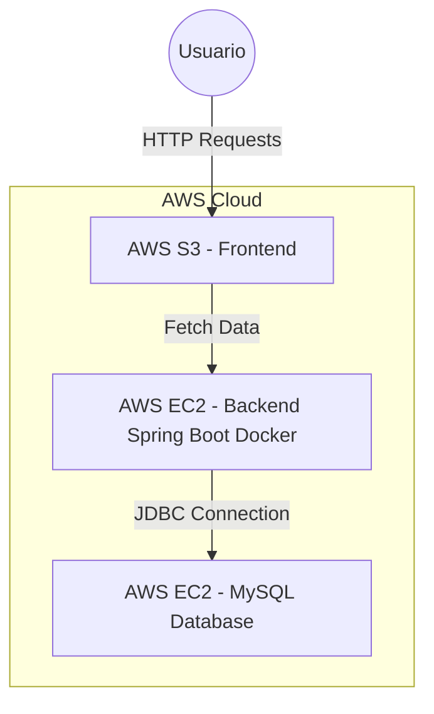
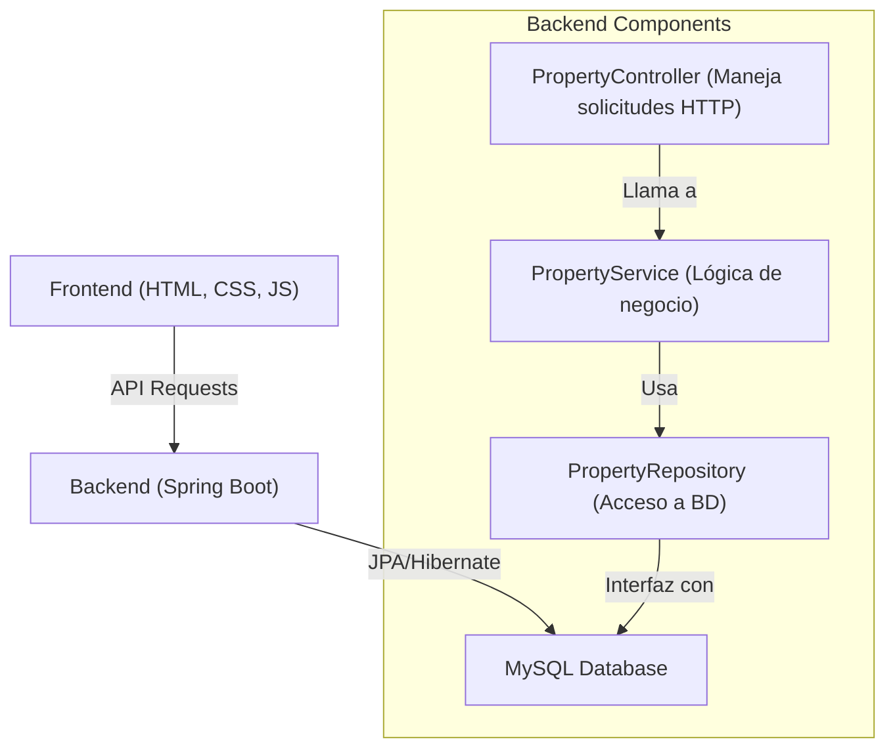

# **Sistema de Gestión de Propiedades**

## **Resumen del Proyecto**
El Sistema de Gestión de Propiedades es una aplicación web diseñada para administrar bienes raíces de manera eficiente. Proporciona una interfaz fácil de usar para agregar, actualizar, eliminar y ver detalles de propiedades como dirección, precio, tamaño y descripción. El sistema está compuesto por:
- Un **frontend** desarrollado en HTML, CSS y JavaScript.
- Un **backend** construido con **Spring Boot** y MySQL para la persistencia de datos.
- Una **base de datos** alojada en AWS EC2 utilizando MySQL.

## **Arquitectura del Sistema**
El sistema sigue una **arquitectura de tres capas**:

### **1️⃣ Frontend (Cliente)**
- Aplicación **web estática** alojada en **AWS S3**.
- Usa **JavaScript** para la interacción dinámica.
- Obtiene datos del backend mediante **solicitudes REST API**.

### **2️⃣ Backend (Servidor API)**
- Construido con **Spring Boot** y ejecutado en un **contenedor Docker** en **AWS EC2**.
- Proporciona endpoints RESTful para **gestionar propiedades (operaciones CRUD)**.
- Utiliza **JPA y Hibernate** para la interacción con la base de datos.
- Maneja **políticas CORS** para permitir la interacción con el frontend.

### **3️⃣ Base de Datos (Almacenamiento de Datos)**
- Base de datos **MySQL** ejecutándose en **AWS EC2**.
- Almacena todos los detalles de las propiedades.
- Protegida mediante variables de entorno para evitar exposición de credenciales.

### **Flujo del Sistema**
1. El **frontend** envía una solicitud HTTP a la **API del backend**.
2. El **backend** procesa la solicitud e interactúa con **MySQL**.
3. La respuesta se envía de vuelta al **frontend**, actualizando dinámicamente la UI.

## **Diseño de Clases**

### **Principales Clases**
| Nombre de la Clase   | Descripción |
|----------------------|-------------|
| `Property`          | Clase entidad que representa una propiedad. |
| `PropertyController` | Controlador REST que maneja las solicitudes HTTP. |
| `PropertyService`    | Capa de servicio que gestiona la lógica de negocio. |
| `PropertyRepository` | Interfaz que extiende JPA Repository para operaciones en la base de datos. |

### **Diagrama de Clases**


### **Diagrama de despliegue**




## **Diagrama de componentes**





## **Instrucciones de Despliegue**
### **1️⃣ Despliegue del Backend (Spring Boot en Docker en AWS EC2)**
#### **Construir y Subir Imagen Docker**
```sh
mvn clean package
```
```sh
docker build -t tu_usuario_docker/property-management .
docker push tu_usuario_docker/property-management
```

#### **Ejecutar el Contenedor en AWS EC2**
```sh
docker pull tu_usuario_docker/property-management
docker run -d -p 8080:8080 --name backend -e DB_URL="jdbc:mysql://tu-servidor-mysql:3306/properties" -e DB_USER="tu_usuario" -e DB_PASS="tu_contraseña" tu_usuario_docker/property-management
```

### **2️⃣ Despliegue del Frontend (Sitio Estático en AWS S3)**
1. Crear un **bucket S3** con **hosting de sitio web estático habilitado**.
2. Subir `index.html`, `style.css` y `script.js`.
3. Configurar permisos del bucket para **acceso público de solo lectura**.
4. Acceder a la aplicación a través de la **URL pública de S3**.

### **3️⃣ Configuración de la Base de Datos (MySQL en AWS EC2)**
1. Instalar MySQL Server en EC2:
   ```sh
   sudo apt update && sudo apt install mysql-server -y
   ```
2. Configurar MySQL y crear la base de datos:
   ```sql
   CREATE DATABASE properties;
   CREATE USER 'tu_usuario'@'%' IDENTIFIED BY 'tu_contraseña';
   GRANT ALL PRIVILEGES ON properties.* TO 'tu_usuario'@'%';
   FLUSH PRIVILEGES;
   ```
3. Permitir conexiones remotas editando `/etc/mysql/mysql.conf.d/mysqld.cnf`:
   ```ini
   bind-address = 0.0.0.0
   ```
4. Reiniciar MySQL:
   ```sh
   sudo systemctl restart mysql
   ```

## **Capturas de Pantalla**


https://github.com/user-attachments/assets/b2e2a9b5-3f46-4b17-a300-a2109be1a5db

---
## **📌 Notas Adicionales**
- El backend usa **configuración CORS** para permitir solicitudes desde el frontend.
- Todas las credenciales sensibles se almacenan como **variables de entorno**.


📢 **Desarrollado y mantenido por Tomas Suarez**
